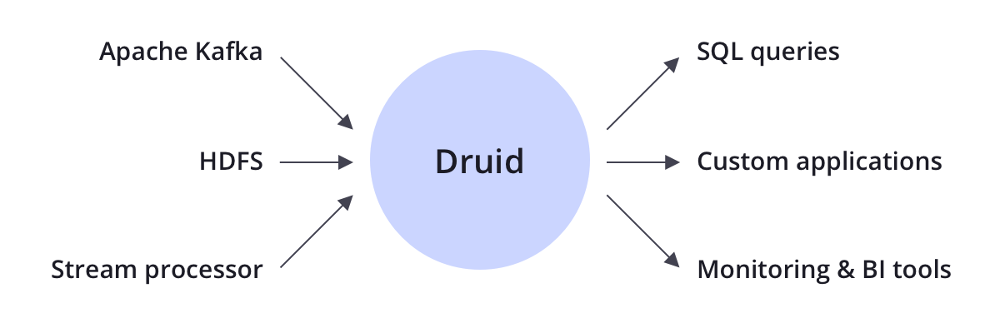
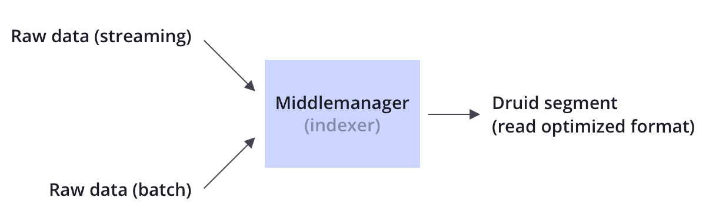
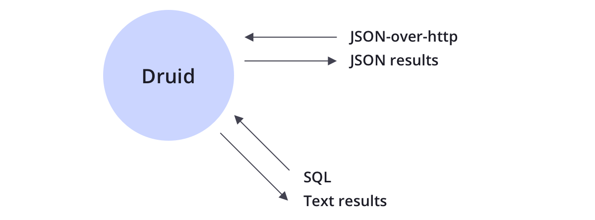
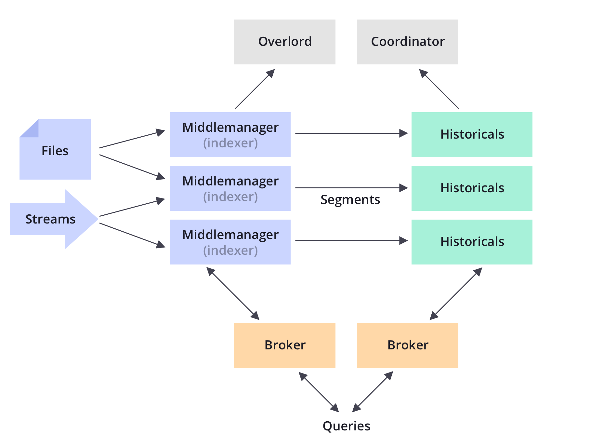

Druid is an open source distributed data store.
Druid’s core design combines ideas from [OLAP/analytic databases](https://en.wikipedia.org/wiki/Online_analytical_processing), [timeseries databases](https://en.wikipedia.org/wiki/Time_series_database), and [search systems](https://en.wikipedia.org/wiki/Full-text_search) to create a unified system for operational analytics. Druid merges key characteristics of each of the 3 systems into its ingestion layer, storage format, querying layer, and core architecture.

  

Key features of Druid include:

  

    
    <h5>Column-oriented storage</h5>
    

      Druid stores and compresses each column individually, and only needs to read the ones needed for a particular query, which supports fast scans, rankings, and groupBys.
    

  

  

    
    <h5>Native search indexes</h5>
    

      Druid creates inverted indexes for string values for fast search and filter.
    

  

  

    
    <h5>Streaming and batch ingest</h5>
    

      Out-of-the-box connectors for Apache Kafka, HDFS, AWS S3, stream processors, and more.
    

  

  

    
    <h5>Flexible schemas</h5>
    

      Druid gracefully handles evolving schemas and <a href="/docs/latest/ingestion/flatten-json">nested data</a>.
    

  

  

    
    <h5>Time-optimized partitioning</h5>
    

      Druid intelligently partitions data based on time and time-based queries are significantly faster than traditional databases.
    

  

  

    
    <h5>SQL support</h5>
    

      In addition to its native <a href="/docs/latest/querying/querying">JSON based language</a>, Druid speaks <a href="/docs/latest/querying/sql">SQL</a> over either HTTP or JDBC.
    

  

  

    
    <h5>Horizontally scalable</h5>
    

      Druid has been <a href="druid-powered">used in production</a> to ingest millions of events/sec, retain years of data, and provide sub-second queries.
    

  

  

    
    <h5>Easy to operate</h5>
    

      Scale up or down by just adding or removing servers, and Druid automatically rebalances. Fault-tolerant architecture routes around server failures.
    

  

## Integration

Druid is complementary to many open source data technologies in the Apache Software Foundation including Apache Kafka, Apache Hadoop, Apache Flink, and more.

Druid typically sits between a storage or processing layer and the end user, and acts as a query layer to serve analytic workloads.

  

## Ingestion

Druid supports both streaming and batch ingestion.
Druid connects to a source of raw data, typically a message bus such as Apache Kafka (for streaming data loads), or a distributed filesystem such as HDFS (for batch data loads).

Druid converts raw data stored in a source to a more read-optimized format (called a Druid “segment”) in a process calling “indexing”.

  

For more information, please visit [our docs page](http://druid.io/docs/latest/ingestion/index.html).

## Storage

Like many analytic data stores, Druid stores data in columns.
Depending on the type of column (string, number, etc), different compression and encoding methods are applied.
Druid also builds different types of indexes based on column type.

Similar to search systems, Druid builds inverted indexes for string columns for fast search and filter.
Similar to timeseries databases, Druid intelligently partitions data by time to enable fast time-oriented queries.

Unlike many traditional systems, Druid can optionally pre-aggregate data as it is ingested.
This pre-aggregation step is known as [rollup](/docs/latest/design/#roll-up), and can lead to dramatic storage savings.

  

For more information, please visit [our docs page](http://druid.io/docs/latest/design/segments.html).

## Querying

Druid supports querying data through [JSON-over-HTTP](/docs/latest/querying/querying) and [SQL](/docs/latest/querying/sql).
In addition to standard SQL operators, Druid supports unique operators that leverage its suite of approximate algorithms to provide rapid counting, ranking, and quantiles.

  

For more information, please visit [our docs page](http://druid.io/docs/latest/querying/querying.html).

## Architecture

Druid can be thought of as a disassembled database.
Each core process in Druid (ingestion, querying, and coordination) can be separately or jointly deployed on commodity hardware.

Druid explicitly names every main process to allow the operator to fine tune each process based on the use case and workload.
For example, an operator can dedicate more resources to Druid’s ingestion process while giving less resources to Druid’s query process if the workload requires it.

Druid processes can independently fail without impacting the operations of other processes.

  

For more information, please visit [our docs page](http://druid.io/docs/latest/design/index.html).

## Operations

Druid is designed to power applications that need to be up 24 hours a day, 7 days a week.
As such, Druid possesses several features to ensure uptime and no data loss.

  

    
    <h5>Data replication</h5>
    

      All data in Druid is replicated a configurable number of times so single server failures have no impact on queries.
    

  

  

    
    <h5>Independent processes</h5>
    

      Druid explicitly names all of its main processes and each process can be fine tuned based on use case.
      Processes can independently fail without impacting other processes.
      For example, if the ingestion process fails, no new data is loaded in the system, but existing data remains queryable.
    

  

  

    
    <h5>Automatic data backup</h5>
    

      Druid automatically backs up all indexed data to a filesystem such as HDFS.
      You can lose your entire Druid cluster and quickly restore it from this backed up data.
    

  

  

    
    <h5>Rolling updates</h5>
    

      You can update a Druid cluster with no downtime and no impact to end users through rolling updates.
      All Druid releases are backwards compatible with the previous version.
    

  

  

    
    <h5>Horizontally scalable</h5>
    

      Druid scales by adding new servers to the cluster.
      As data volumes or cluster usage grows, resources can be added to ensure performance and stability are not impacted.
         

  

  

    
    <h5>Easy to operate</h5>
    

      Scale up or down by just adding or removing servers, and Druid automatically rebalances. Fault-tolerant architecture routes around server failures.
    

  

For more information, please visit [our docs page](http://druid.io/docs/latest/operations/recommendations.html).
